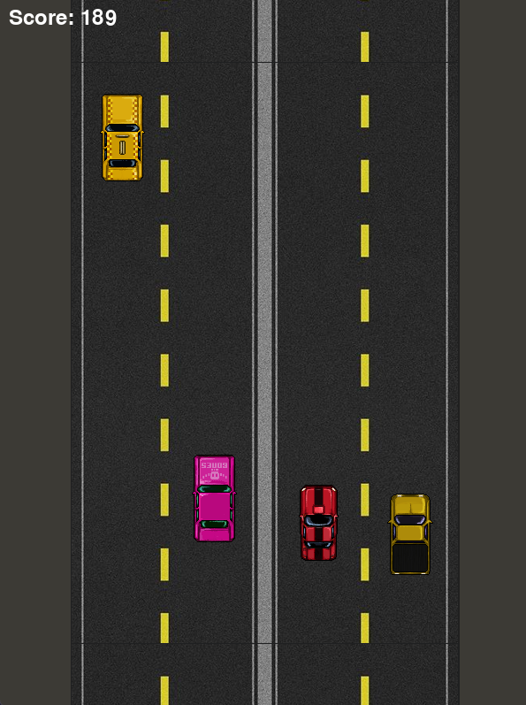
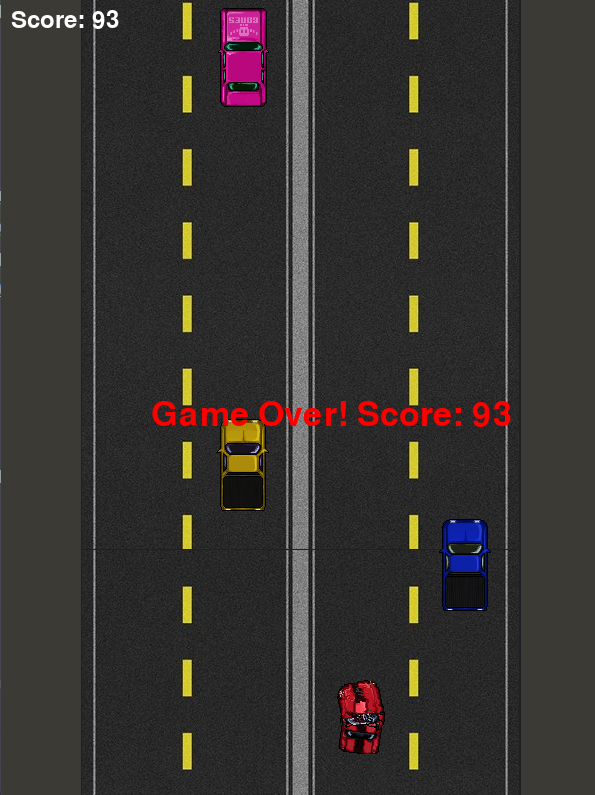

# Гоночная игра на Pygame

## Описание

Это простая гоночная 2D-TopDown-игра, реализованная с использованием Pygame. Игрок управляет автомобилем, перемещая его между четырьмя полосами дороги. Дорога и автомобили NPC двигаются вниз, создавая эффект движения.

---

## Управление

- **Стрелка влево** – перемещение влево  
- **Стрелка вправо** – перемещение вправо  
- **Стрелка вверх** – увеличение скорости  
- **Стрелка вниз** – уменьшение скорости  

---

## Функции

- Реалистичное движение дороги (3 сегмента с плавным обновлением)  
- NPC-автомобили движутся в обоих направлениях  
- Система очков, зависящая от пройденного расстояния  
- Простая система столкновений с экраном "Game Over"  
- Оптимизированный код, соответствующий принципам SOLID  

---

## Структура проекта

```
racing_game/
├── assets/           # Каталог с ресурсами
│   ├── player_car.png
│   ├── npc_car1.png
│   ├── road.png
│   └── ...
│
├── core/             # Основные модули игры
│   ├── game.py       # Основная логика игры
│   ├── player.py     # Класс игрока
│   ├── npc.py        # Класс NPC-автомобилей
│   ├── road.py       # Класс движущейся дороги
│   ├── scoreboard.py # Отображение счета
│   ├── event_handler.py # Обработчик событий
│   └── settings.py   # Настройки игры
│
├── main.py           # Точка входа в игру
└── README.md         # Описание проекта
```

---

## Установка и запуск

### 1. Установите зависимости:

```sh
pip install pygame
```

### 2. Запустите игру:

```sh
python main.py
```

---

## Скриншоты
*Скриншот геймплея*

*Скриншот экрана "Game Over"*


---

## Лицензия

Этот проект распространяется под лицензией MIT. Используйте на свое усмотрение.
